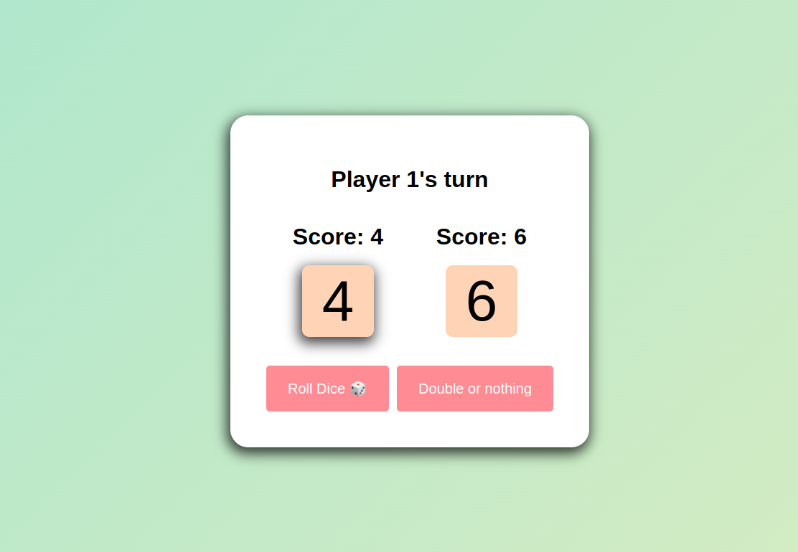
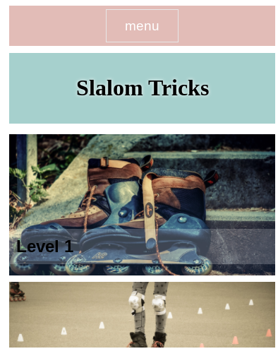
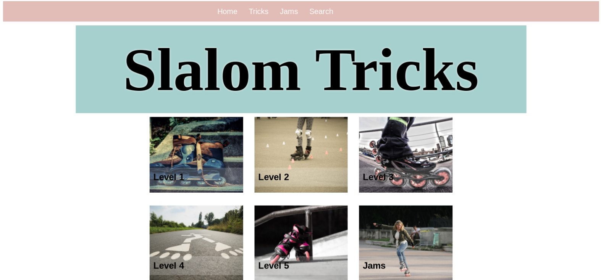
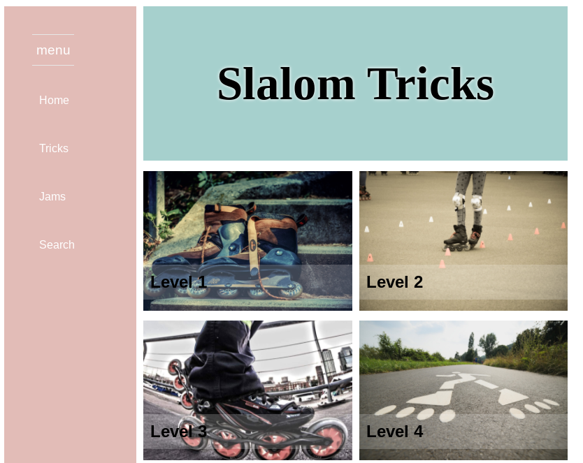

# HTML-CSS-JS-BeginnerProjects

## [Dice Game](https://github.com/caro-oviedo/DiceGame)
<a href="https://github.com/caro-oviedo/DiceGame"> 

## [Figma Hero Page](https://github.com/caro-oviedo/figma-project-hero-page)
<a href="https://caro-oviedo.github.io/figma-project-hero-page/">

## [Carousel JS- CSS](https://github.com/caro-oviedo/carousel-js-css)
https://caro-oviedo.github.io/carousel-js-css/

## [Responsive Blog](https://caro-oviedo.github.io/Responsive-Blog/)
(Responsive Web Design. Html / Css) 

## [BlackJack](https://caro-oviedo.github.io/blackJack/)
(Javascript)

## [SearchBox JS](https://github.com/caro-oviedo/searchbox-Js/tree/main)

## [Modal Js](https://github.com/caro-oviedo/modal-js-css)

## [Slalom Tricks](https://github.com/caro-oviedo/slalom)
(Responsive Web Design. Html / Css )

## [Sheep Counter](https://github.com/caro-oviedo/SheepCounter)
(Because Sheep are cool) 
(Javascript)

